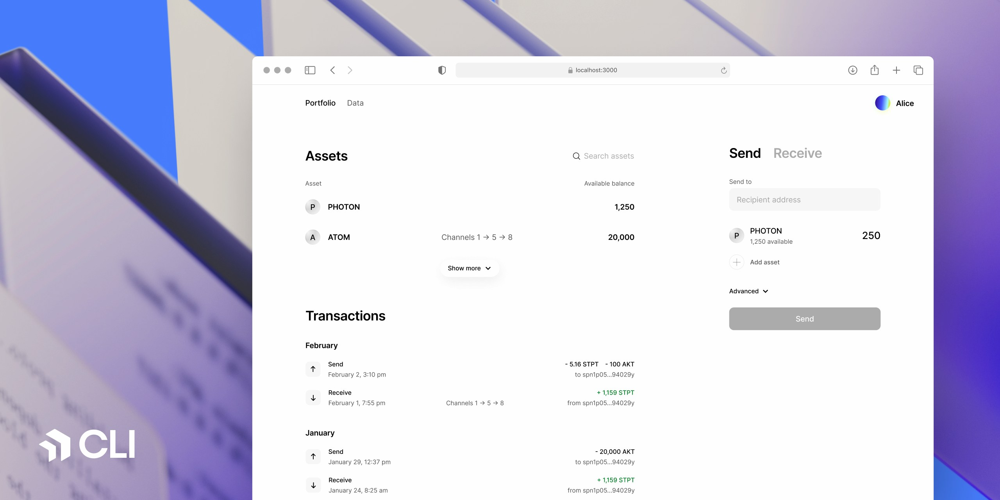

# Ignite Frontend



## Contents

### [App template](https://github.com/ignite/web/tree/develop/packages/vue-template)

A Vue 3 web application template is bundled with the [Ignite CLI](https://github.com/ignite/cli). The template features an asset list, transaction list, token transfer component, and a form component for custom models created with Ignite. The template is connected to the [Keplr](https://github.com/chainapsis/keplr-wallet/) wallet by default.

### [@ignt/vue-library](https://github.com/ignite/web/tree/develop/packages/vue-lib)

A library that contains components used by the template.

## Quick start

Inside your `PROJECT_DIRECTORY/vue` directory, run the following command to start your frontend local environment:

```bash
pnpm install
pnpm dev
```

## Questions

For questions and support, join the official [Ignite Discord](https://discord.com/invite/ignitecli) server. The issue list in this repo is exclusively for bug reports and feature requests.

## Contributing

We welcome contributions from everyone. The `develop` branch contains the development version of the code. You can create a branch from `develop` and create a pull request, or maintain your own fork and submit a cross-repository pull request.

**Important**: Before you start implementing a new feature, the first step is to create an issue on Github that describes the proposed changes.
